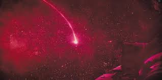
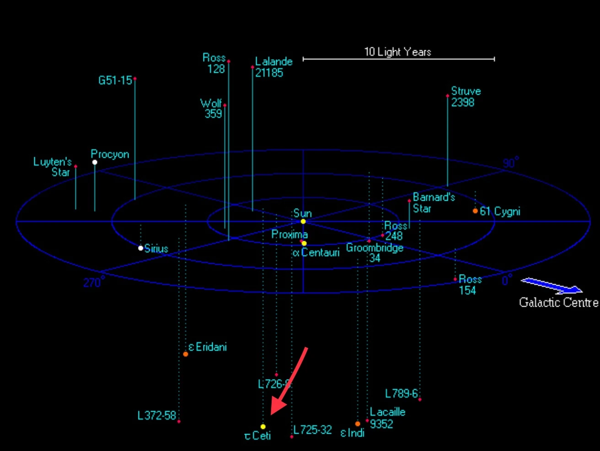

# The Petrova Line Problem

In the 2026 film *Project Hail Mary* (based on the science-fiction novel by Andy Weir), we explore a terrifying astronomical mystery facing humanity. The Sun is slowly losing its luminosity (dimming). The culprit is a microorganism-like extraterrestrial lifeform called **Astrophage** that thrives in the solar atmosphere and consumes solar energy at a rate that threatens the global climate. These organisms spread through space and feed on stellar radiation, effectively reducing the energy output of stars over time. Since Earth's climate and biosphere depend entirely on solar energy, even a slight decrease in solar luminosity would trigger global cooling and eventually the extinction of human civilization. The mystery begins when astronomer Irina Petrova identifies a strange infrared arc extending from the Sun toward Venus, as shown in Figure 1. It becomes the first major clue that something unnatural is happening to the Sun and nearby stars, later named the **Petrova Line**. In stellar spectroscopy, light typically follows blackbody radiation and atomic absorption laws. However, the Petrova Line represents an anomalous infrared absorption feature where Astrophage are actively harvesting energy.

The global response to save humanity is *Project Hail Mary*, an interstellar mission to Tau Ceti, the only nearby star seemingly resistant to this infection. The mission’s main character is Ryland Grace, a middle-school teacher and PhD molecular biologist. His expertise is required because the threat is biological rather than purely astronomical Humanity needs someone who can understand Astrophage—an organism capable of absorbing and storing enormous amounts of energy. Since Astrophage behaves like a living organism rather than a machine, biology becomes essential. Grace’s combined background in biology, engineering intuition, and teaching ability makes him uniquely suited for the mission. This is a strong example of interdisciplinary science (similar to nuclear astrophysics), where biology, astrophysics, and engineering converge to save humankind.

*Distance between the Solar System and Tau Ceti (~11.9 light years).  
For Ryland Grace, this represents a one-way interstellar journey*

I do not wish to spoil this story further. Instead, I encourage you to explore both the book and film versions of *Project Hail Mary*. In this assignment, we focus on the conceptual scientific problem and apply nuclear astrophysics and stellar structure concepts to the Petrova Line.

---
[The Petrova Problem](../pdf/petrova_problem.pdf)