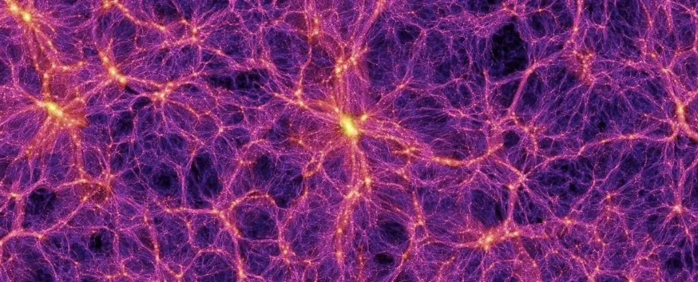

# Chapter 10: Big Bang Nucleosynthesis (BBN)

*Building the first nuclei — with a gentle introduction to cosmology.*

### Slides
[BBN](assets/class10/bbn.pdf)  NEW

*The cosmic web: the large-scale distribution of matter that grew, over billions of years, out of the hot, nearly uniform plasma whose first three minutes we study here.*

This class is our first proper look at **physical cosmology**: the study of the Universe as a single evolving system. The story has a clear destination. Within the first few **minutes** after the Big Bang, protons and neutrons fused into the lightest elements, fixing the roughly **75% hydrogen / 25% helium** composition that the cosmos still wears today. Reproducing that ratio from known nuclear and weak-interaction physics is one of the great triumphs of the hot Big Bang model — and the goal of this chapter.

### What is cosmology?

Cosmology is the scientific study of the Universe *as a whole* — its origin, evolution, content, and fate. It is a peculiar science: can the container of all objects be studied as if it were one of the objects inside it? The answer is essentially yes, but at a price. We must assume the **Cosmological Principle**: on large scales the Universe is **homogeneous** (the same everywhere) and **isotropic** (the same in every direction), in both its contents and its laws. Cosmology is, in a sense, the science that tests this principle — break it, and cosmology as a predictive science is in trouble.

### The Universe is not static

Four independent facts all point to the same picture — an expanding, cooling Universe with a hot beginning:

1. **Distant galaxies are redshifted** ⇒ the Universe expands.
2. **Matter is ~75% H and ~25% He by mass** ⇒ the Universe was once hot and dense.
3. **It is bathed in low-energy photons** — the Cosmic Microwave Background (CMB), a ~2.7 K black body ⇒ a hot past in thermal equilibrium.
4. **The distant Universe is measurably hotter** (e.g. T ~ 5.08 K at redshift z = 0.89).

### Redshift and the scale factor

A spectral line emitted at wavelength λe is observed at a longer wavelength λo. The **redshift** is

$$ z = \frac{\lambda_o - \lambda_e}{\lambda_e}. $$

Crucially, cosmological redshift is **not** a Doppler effect. The reddening is produced by the stretching of distances *during the light's journey*, not by the source moving through space.

All comoving distances grow with a single **scale factor** a(t):

$$ r(t) = a(t)\, r_0, \qquad a(t_0) = 1 \text{ today}. $$

Here r0 is the (time-independent) comoving distance and r(t) is the physical distance. The expansion rate is the **Hubble parameter** H(t) = ȧ/a, giving **Hubble's law** v = H0 d, with H0 ≃ 70 km/s/Mpc. (Planck gives ~67 and local supernovae ~72 — the unresolved "H0 tension".)

Photon wavelengths stretch exactly like every other distance, so

$$ 1 + z = \frac{1}{a} \quad\Longleftrightarrow\quad a = \frac{1}{1+z}. $$

**Measuring z is measuring the size of the Universe when the light was emitted** — redshift is a clock reading of cosmic history. Recombination, for instance, sits at z ≃ 1100, i.e. a ≃ 10⁻³.

### The content of the Universe

The dynamics of a(t) are driven by the energy content. Today's budget (the ΛCDM "concordance model") is roughly:

| Component | Symbol | Fraction |
|---|---|---|
| Dark energy (vacuum) | ΩΛ | ~0.68 |
| Dark matter | Ωdm | ~0.27 |
| Baryons (ordinary matter) | Ωb | ~0.05 |
| Radiation | Ωr | ~10⁻⁴ (tiny today) |

**For BBN, only two components matter**: the *radiation* that dominated the early Universe, and the *baryons* whose nuclei we will build. The amount of baryons is captured by a single number, η.

### Friedmann equation and the domination eras

General Relativity, applied to a homogeneous, isotropic fluid, links the expansion rate to the energy density of each component:

$$ H^2 = \left(\frac{\dot a}{a}\right)^2 = H_0^2\left(\frac{\Omega_m}{a^3} + \frac{\Omega_r}{a^4} + \Omega_v - \frac{\Omega_K}{a^2}\right). $$

Each fluid dilutes differently: matter ∝ a⁻³, radiation ∝ a⁻⁴, vacuum = const. Because they scale differently, the Universe passes through three regimes:

$$ \underbrace{a \propto t^{1/2}}_{\text{radiation}} \;\longrightarrow\; \underbrace{a \propto t^{2/3}}_{\text{matter}} \;\longrightarrow\; \underbrace{a \propto e^{H_0 t}}_{\text{vacuum}}. $$

Radiation (∝ a⁻⁴) always wins at the smallest a, i.e. the earliest times. **BBN takes place deep in the radiation-dominated era, so throughout this chapter a(t) ∝ √t.** This single relation controls how fast the young Universe expands and cools.

### Temperature is a clock

Photons redshift as the Universe expands, and their black-body temperature obeys T = T0/a = T0(1 + z), with T0 = 2.73 K. Combined with a ∝ √t, temperature becomes a direct readout of cosmic time:

$$ T \sim \frac{10^{10}\,\text{K}}{\sqrt{t\,(\text{s})}} \quad\Longleftrightarrow\quad k_B T \sim \frac{1\,\text{MeV}}{\sqrt{t\,(\text{s})}}. $$

So **t ~ 1 s ⇔ kBT ~ 1 MeV** — exactly the energy scale of nuclear and weak physics. That coincidence is *why* BBN happens when it does.

## The hot Universe: equilibrium and freeze-out

The whole of BBN is a competition between two effects that change the number density n(t) of each species:

1. **Cosmological dilution** — expansion spreads particles out: dn/dt = −3H n. This is slow, acting on the Hubble timescale.
2. **Reactions** — creation and destruction: dn/dt = −Γ n, with rate Γ ~ v σ nt.

When reactions are fast they hold a species at its **equilibrium abundance** ne, behaving like a restoring force. Putting both effects together gives the master equation:

$$ \frac{dn}{dt} = -3H\,n - \Gamma\,(n - n_e). $$

Two timescales compete:

- **Γ ≫ H** — reactions win ⇒ n ≃ ne (**equilibrium**).
- **Γ ≪ H** — expansion wins ⇒ only dilution, and the total number in a comoving volume is conserved. The species is **frozen**.

### Freeze-out

During radiation domination, H ~ a⁻² while Γ ~ a⁻³·⁵ (falling faster). So **every species eventually freezes out**: the crossover Γ ≃ H defines freeze-out, and the frozen value is a **relic** of the conditions at that moment. BBN is essentially a *sequence of freeze-outs* — neutrinos, the n/p ratio, and finally the nuclei themselves.

### Equilibrium abundances and the photon budget

In equilibrium, abundances follow from statistical mechanics (Fermi–Dirac for fermions, Bose–Einstein for bosons). For photons this gives the black-body result

$$ n_\gamma \simeq 0.244\left(\frac{k_B T}{\hbar c}\right)^3 \approx 413 \text{ photons/cm}^3 \text{ today}. $$

Photons vastly outnumber baryons — a fact that turns out to be decisive for BBN.

### The baryon-to-photon ratio η

The single most important number for BBN is

$$ \eta = \frac{n_b}{n_\gamma} \sim 5 \times 10^{-10}. $$

There are roughly **a billion photons for every baryon**. Once frozen, both nb and nγ dilute as a⁻³, so η stays constant. Its extreme smallness will delay nucleosynthesis and set the final abundances. Remarkably, **both BBN and the CMB measure η independently — and they agree.**

### Relativistic vs non-relativistic, and relics

A particle's mass sets a critical temperature kBT ~ mc². While ultra-relativistic (kBT ≫ mc²) a species is as abundant as photons; once non-relativistic (kBT ≪ mc²) its equilibrium abundance is **Boltzmann-suppressed**, ne ∝ e^(−mc²/kBT), and it annihilates away. Freeze-out interrupts that annihilation, leaving a relic. Particles that freeze out *while still relativistic* (like neutrinos) stay very abundant and form cosmic backgrounds. This same freeze-out logic drives everything that follows.

## The three characters of the BBN story

Everything below is **three freeze-outs in sequence**, all set in motion around the landmark epoch **kBT ~ 1 MeV, t ~ 1 s**:

1. **Neutrinos decouple** ⇒ the cosmic neutrino background.
2. **The n/p ratio freezes** ⇒ sets how many neutrons are available.
3. **Nuclei form** once the deuterium bottleneck breaks (t ~ 3 min) ⇒ locks in the light-element abundances.

### 1. The cosmic neutrino background

Before t ~ 1 s, neutrinos, electrons/positrons, and photons share one temperature. As e⁺e⁻ pairs turn non-relativistic and annihilate, the weak reactions holding neutrinos in the bath switch off (Γweak < H) and **neutrinos freeze out while still relativistic** — so they remain abundant.

The e⁺e⁻ pairs then annihilate into photons. Neutrinos are already decoupled and miss out, but photons inherit the entropy — effectively a "reheat." Entropy conservation gives the famous factor

$$ T_\nu = \left(\frac{4}{11}\right)^{1/3} T_\gamma \simeq 1.95 \text{ K} \quad (\text{vs } 2.73 \text{ K for the CMB}). $$

This relic neutrino background is a genuine fossil from t ~ 1 s — **even earlier than the CMB** — and although predicted, it has not yet been directly detected. It matters for BBN because its energy density feeds into H: **more relativistic species ⇒ faster expansion ⇒ earlier n/p freeze-out ⇒ more neutrons ⇒ more helium.** BBN therefore *counts* light species, constraining the effective number of neutrino families Neff ≃ 3 — cosmology used as a particle-physics laboratory.

### 2. The neutron-to-proton ratio

Around t ~ 1 s, protons and neutrons are already non-relativistic and interconvert through weak reactions (n + νe ↔ p + e⁻, etc.). While these are fast, the ratio tracks a Boltzmann factor in the neutron–proton mass difference:

$$ \frac{n}{p} \simeq \exp\!\left(-\frac{(m_n - m_p)c^2}{k_B T}\right), \qquad (m_n - m_p)c^2 \simeq 1.29 \text{ MeV}. $$

At high T, n/p → 1; as T drops below ~1 MeV the heavier neutrons become rarer. If the reactions stayed fast forever, n/p → 0 and no neutrons would survive — but they don't. The weak rates freeze out at kBT ~ 0.8 MeV (t ~ 1 s), locking in

$$ \left.\frac{n}{p}\right|_{\text{freeze}} \simeq \frac{1}{6}. $$

Free neutrons are unstable (lifetime τn ≃ 880 s ≈ 15 min). Between freeze-out and the onset of fusion (~3 min), some β-decay (n → p + e⁻ + ν̄e), drifting the ratio down to

$$ \frac{n}{p} \simeq \frac{1}{7} \text{ at the start of nucleosynthesis.} $$

This one number essentially decides the helium yield, because almost all available neutrons end up locked in helium-4:

$$ Y_p = \frac{2(n/p)}{1 + (n/p)} = \frac{2/7}{8/7} = \frac{1}{4} = 0.25. $$

**The famous 25% helium by mass is, at heart, just the frozen neutron-to-proton ratio ~1/7.**

## Nucleosynthesis: building the nuclei

### Deuterium: the gateway

Every path to helium runs through **deuterium** (D = 1 proton + 1 neutron), the simplest composite nucleus, formed via p + n ⇌ D + γ. You cannot fuse two protons or two neutrons into anything stable, so D is the mandatory first step. Its binding energy is BD ≃ 2.2 MeV. **No deuterium ⇒ no helium** — so the entire timing of BBN hinges on when deuterium can survive.

### The deuterium bottleneck

The equilibrium deuterium fraction is

$$ X_D \sim \eta\,(k_B T)^{3/2}\, e^{B_D/k_B T}. $$

Naively, once kBT drops below BD = 2.2 MeV (already true at t ~ 1 s) deuterium should form. It does **not** — because of the tiny prefactor η ~ 10⁻¹⁰. With ~10⁹ photons per baryon, even when the *average* photon is too cool, the high-energy **tail** of the photon distribution still contains plenty of photons above 2.2 MeV, and these **photo-dissociate** newly formed deuterons faster than they accumulate.

Only when the whole photon bath cools to kBT ~ 0.07 MeV does the exponential finally overwhelm η, and deuterium survives:

$$ t \sim 3 \text{ minutes, not } 1 \text{ second.} $$

This delay is the **deuterium bottleneck**. When it breaks, the floodgates open.

### Helium-4 and why fusion stops there

Once deuterium survives, fusion proceeds rapidly through chains such as D + D → ³He + n and ³He + D → ⁴He + p, sweeping nearly all neutrons into tightly bound ⁴He. Counting with n : p = 1 : 7: two neutrons and two protons build one ⁴He, leaving 12 protons as hydrogen — one helium nucleus per twelve hydrogen nuclei, i.e. **~75% H and ~25% He by mass**, matching observation.

BBN then essentially halts, for two reasons:

- **Nuclear structure:** there are no stable nuclei at mass number A = 5 or A = 8, breaking the easy "add a nucleon" ladder just above helium.
- **Cosmic conditions:** bridging that gap needs high density and time, but a few minutes in, the Universe is already too cold and too dilute.

Heavier elements (C, O, Fe, …) must wait billions of years, forged later inside stars.

### The trace products: D, ³He, ⁷Li

BBN does not burn everything into ⁴He. Small amounts survive, and because each depends on η, measuring them measures the baryon content of the Universe:

- **Deuterium** D/H ~ 10⁻⁵ — leftover from the bottleneck.
- **Helium-3** ³He/H ~ 10⁻⁵.
- **Lithium-7** ⁷Li/H ~ 10⁻¹⁰ — a tiny yield.

## Observations and cosmological significance

From essentially **one free parameter** (η, equivalently Ωbh²), the BBN code predicts *all* the light-element abundances. Each responds to η differently: Yp depends only weakly on it; D/H is steep and monotonic — an excellent "baryometer"; ⁷Li traces a non-monotonic valley.

Comparing predictions with observation:

- **Helium-4** is measured in metal-poor extragalactic H II regions and extrapolated to zero metallicity: Ypobs ≃ 0.245 — in striking agreement with the naive 1/7 estimate.
- **Deuterium**, which stars only destroy, is measured in pristine high-redshift gas: D/H ≃ 2.5 × 10⁻⁵. Its steep dependence on η pins the cosmic baryon density to a few percent.

The decisive result is a **concordance of two independent clocks**:

| Method | Epoch probed |
|---|---|
| BBN (D/H, Yp) | t ~ 3 min |
| CMB acoustic peaks (Planck) | t ~ 380 000 yr |

Both give **Ωbh² ≃ 0.022** — from physics separated by ~400 000 years and completely different observables. Independent clocks, one answer.

### The lithium problem

Not everything fits. BBN + the CMB value of η predict a ⁷Li abundance about **three times higher** than measured in old halo stars. Possible culprits include stellar depletion of lithium, uncertain nuclear reaction rates, or new physics. It remains an open, actively debated question — BBN's one persistent blemish.

### BBN as a pillar of the hot Big Bang

Alongside the Hubble expansion and the CMB, BBN is one of the three classic observational pillars of Big Bang cosmology. It is remarkable because it probes the Universe at t ~ 1–180 s (the earliest epoch testable with ordinary nuclear physics), uses only laboratory-measured microphysics, successfully predicts abundances spanning ten orders of magnitude (H to ⁷Li), and doubles as a particle-physics probe (Neff, the neutron lifetime, exotic relics).

## Summary

**The BBN timeline in one table:**

| Time | kBT | What happens |
|---|---|---|
| ~1 s | ~1 MeV | ν decouple; n/p freezes at 1/6 |
| 1 s → 3 min | MeV → 0.1 MeV | neutrons β-decay: n/p → 1/7 |
| ~3 min | ~0.07 MeV | deuterium bottleneck breaks |
| ~3–20 min | — | rapid fusion → ⁴He (+ traces of D, ³He, ⁷Li) |
| end | — | ~75% H, ~25% He by mass; abundances frozen |

**Key results to remember:**

- The early Universe was **hot, dense, radiation-dominated**, with a ∝ √t and kBT ~ 1 MeV/√(t/s).
- Everything is governed by **freeze-out**: Γ falls faster than H, so each species eventually freezes.
- Two frozen numbers drive BBN: **η ~ 5 × 10⁻¹⁰** and **n/p ≃ 1/7**.
- Helium follows almost entirely from n/p: **Yp ≃ 0.25**.
- The tiny η causes the **deuterium bottleneck**, delaying fusion to ~3 minutes.
- Predicted abundances agree with observation **and** with the CMB's independent value of η.

**Open questions and outlook:**

- **Baryogenesis:** why is η ~ 10⁻¹⁰ at all? A normal freeze-out would give ~10⁻¹⁸, so a matter–antimatter asymmetry (Sakharov conditions) is required — its origin unknown.
- **The lithium problem:** a persistent ~3σ mismatch.
- **The cosmic neutrino background:** predicted at 1.95 K, still undetected directly.
- **New physics:** BBN constrains extra relativistic species, decaying particles, varying constants, and more.

> BBN is the deepest routinely-testable window we have on the early Universe.

### References and further reading

- S. Weinberg, *Cosmology*, Oxford (2008).
- E. Kolb & M. Turner, *The Early Universe*, Addison-Wesley.
- J. Peacock, *Cosmological Physics*, Cambridge.
- Mo, van den Bosch & White, *Galaxy Formation and Evolution*.
- Particle Data Group, *Review of Particle Physics* — "Big-Bang Nucleosynthesis" chapter (updated yearly): pdg.lbl.gov.
- IPAC / NED Level 5 knowledge base: ned.ipac.caltech.edu/level5/.