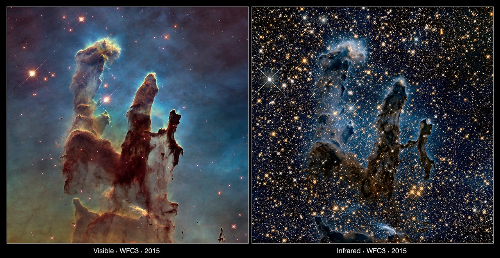

# Chapter 3: Star Formation

This class, *Physics of Stars III* explores the star formation mechanics of stars. We focus heavily on the critical transitions from interstellar gas to active stellar cores. The topics includes initial stages of star formation within cold, dense cosmic environments, tracing how massive molecular clouds fragment and collapse under gravity to form protostars. A premier real world laboratory for these exact stellar mechanics is the *Eagle Nebula*, specifically the famous structure known as the *Pillars of Creation*. These columns of interstellar gas and dust perfectly illustrate the early stages of star formation taught in this class

In visible light observations (like those famously captured by the Hubble Space Telescope), the pillars appear as dark, dense, and monolithic towers of cold gas. They look opaque because they are composed of thick interstellar dust. This dust scatters and absorbs shorter wavelengths of visible light, completely blocking out our view of whatever is happening inside or behind the columns. You can see a ghostly, glowing haze around the edges of the pillars. This is caused by intense ultraviolet radiation from hot newborn stars cooking the outer layers.

When viewed in infrared light (ex James Webb Space Telescope) the cosmic veil is lifted, revealing a completely different environment Infrared light has longer wavelengths than visible light, allowing it to pass right through the dense dust grains instead of being scattered. The previously dark, opaque pillars suddenly become semi-transparent. Because infrared light can escape the dust columns, it exposes the hidden stellar nurseries inside. In infrared, the pillars are suddenly speckled with brilliant red and bright orange points of light. These are the active **protostars** and newly forming stellar cores that are currently gathering mass and heating up, moving toward the quantum limits of stardom that we calculate in the course.

## Reading Materials
You can download the PDF notes for Class 3 here
[Class 3 Notes](assets/pdfs/class3/note3.pdf)

## Slides
Lecture 3 (Star Formation)
[Lecture 3](assets/pdfs/class3/presentation.pdf)

