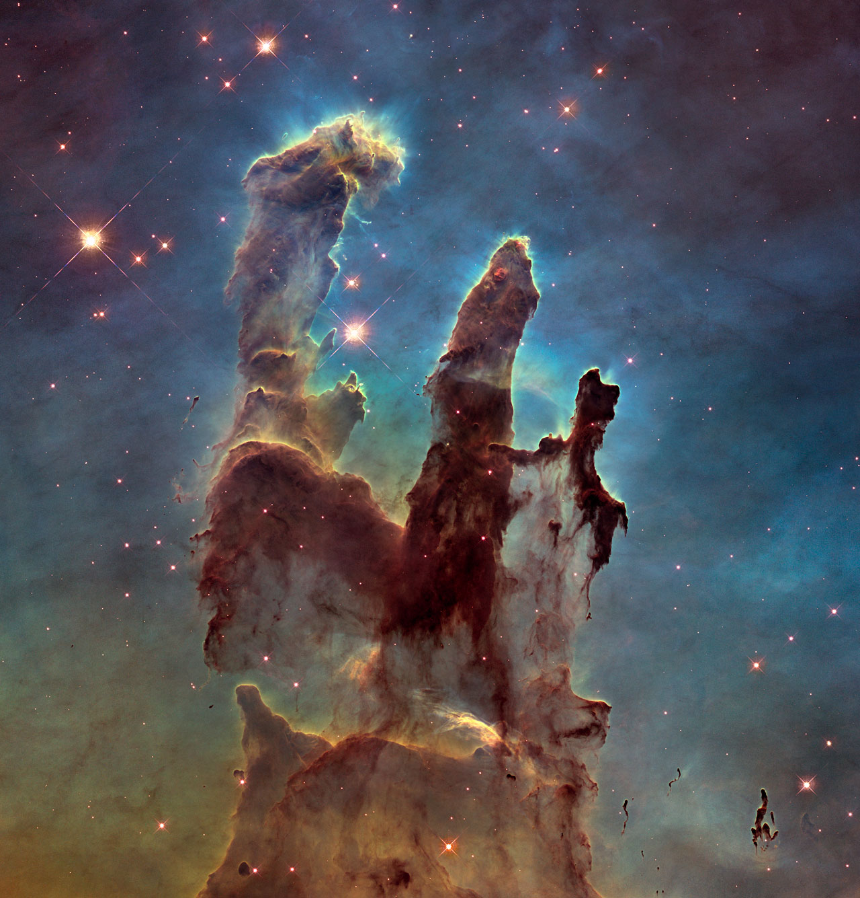
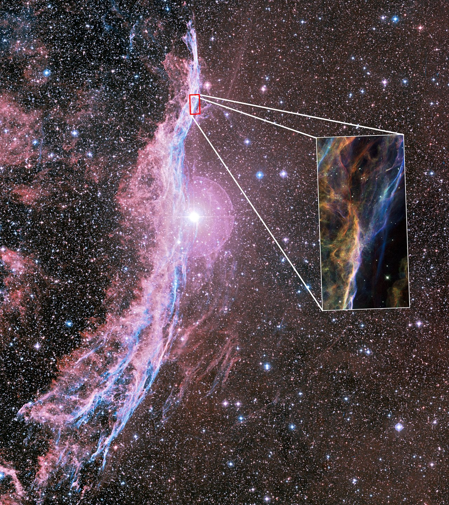

# Welcome to Nuclear Astrophysics 
Course website for Nuclear Astrophysics NS 3035 (Colombo Uni, 2026)

## Course Overview
- **Teacher:** Dehiwalge Don Dilruwan
- **Class:** April 2026

<table>
  <tr>
    <td></td>
    <td></td>
  </tr>
</table>

## Bibliographic Project 2026
### Research Literature 2026

Please select one paper from the list for your bibliographic project. These papers represent the pillars of nuclear astrophysics, from foundational theory to modern machine learning and computational breakthroughs.

#### Foundations of Nucleosynthesis
1. [The B2FH Paper](assets/papers/E_Theory_of_everything_[B2.pdf): Burbidge, E. M., et al. (1957). Synthesis of the Elements in Stars
2. [Primordial Nucleosynthesis](assets/papers/B_Primodial_Nucleosynthesis.pdf): Iliadis, C. & Coc, A. (2020). Thermonuclear Reaction Rates and Primordial Nucleosynthesis

#### Stellar Evolution & Massive Stars
3. [Solar Neutrino Problem](assets/papers/G_Solar_Neutrino_Problem.pdf): Ahmad, Q. R., et al. (2002). Direct Evidence for Neutrino Flavor Transformation from Neutral-Current Interactions in the Sudbury Neutrino Observatory
4. [Stellar Nucleosynthesis in Massive Stars](assets/papers/J_Massive_Stars_[Stellar_nucleosynthesis].pdf): Dumont, T., et al. (2024). Massive star evolution with a new 12C + 12C nuclear reaction rate

#### Explosive Nucleosynthesis & Heavy Elements
5. [Core-Collapse Supernovae](assets/papers/F_core_collapseSN_[Explosive_Nucleosynthesis].pdf): Janka, H.-T. (2012). Explosion Mechanisms of Core-Collapse Supernovae
6. [AGB Stars and s/r-processes](assets/papers/H_AGB_stars_[sr_processes].pdf): Cescutti, G. & Matteucci, F. (2025). Impact of AGB stars on the chemical evolution of neutron-capture element

#### Modern Experimental & Computational Methods
7. [Underground Nuclear Astrophysics](assets/papers/I_underground_nuclear_Astrophysics_[පාතාලේ ].pdf): Broggini, C., et al. (2010). LUNA: Nuclear Astrophysics Deep Underground
8. [Multimessenger Astronomy & Bayesian Stats](assets/papers/A_Multimessenger_Astronomy_[Stat_ML_Bayesian].pdf): Desai, M. M., et al. (2025). Rapid parameter estimation for kilonovae using likelihood-free inference
9. [Neutron Stars and Deep Learning](assets/papers/C_Neutron_Stars_[Deep_Learning].pdf): Fore, B., et al. (2025). Investigating the crust of neutron stars with neural-network quantum states
10. [Neutron Star Mergers and Machine Learning](assets/papers/D_Neutron_Stars_[ML].pdf): Dax, M., et al. (2025). Real-time inference for binary neutron star mergers using machine learning

### Group Performance & Weekly Leaderboard
<table style="width:100%; border-collapse: collapse; font-family: Arial, sans-serif; text-align: center;">
  
  <!-- Header Row -->
  <tr style="background-color:#007bff; color:white;">
    <th style="border:1px solid #ccc; padding:10px; text-align: left;">Group Name</th>
    <th style="border:1px solid #ccc; padding:10px; text-align: left;">Assigned Paper</th>
    <th style="border:1px solid #ccc; padding:10px; width: 10%;">Week 1</th>
    <th style="border:1px solid #ccc; padding:10px; width: 10%;">Week 2</th>
    <th style="border:1px solid #ccc; padding:10px; width: 10%;">Week 3</th>
    <th style="border:1px solid #ccc; padding:10px; width: 10%;">Week 4</th>
    <th style="border:1px solid #ccc; padding:10px; width: 10%;">Week 5</th>
  </tr>

  <!-- Row 1 -->
  <tr>
    <td style="border:1px solid #ccc; padding:10px; text-align: left; font-weight: bold;">Two Half-Lives</td>
    <td style="border:1px solid #ccc; padding:10px; text-align: left;">BBN</td>
    <!-- Highlighted Rank 3: Vibrant Bronze -->
    <td style="border:1px solid #ccc; padding:10px; background-color: #ffe8cc; color: #d97706; font-weight: bold;">3/5</td>
    <td style="border:1px solid #ccc; padding:10px;"></td>
    <td style="border:1px solid #ccc; padding:10px;"></td>
    <td style="border:1px solid #ccc; padding:10px;"></td>
    <td style="border:1px solid #ccc; padding:10px;"></td>
  </tr>

  <!-- Row 2 -->
  <tr>
    <td style="border:1px solid #ccc; padding:10px; text-align: left; font-weight: bold;">Too Hot to collapse</td>
    <td style="border:1px solid #ccc; padding:10px; text-align: left;">SN</td>
    <td style="border:1px solid #ccc; padding:10px;">4/5</td>
    <td style="border:1px solid #ccc; padding:10px;"></td>
    <td style="border:1px solid #ccc; padding:10px;"></td>
    <td style="border:1px solid #ccc; padding:10px;"></td>
    <td style="border:1px solid #ccc; padding:10px;"></td>
  </tr>

  <!-- Row 3 -->
  <tr>
    <td style="border:1px solid #ccc; padding:10px; text-align: left; font-weight: bold;">Solar Flux Duo</td>
    <td style="border:1px solid #ccc; padding:10px; text-align: left;">SNO</td>
    <td style="border:1px solid #ccc; padding:10px;">5/5</td>
    <td style="border:1px solid #ccc; padding:10px;"></td>
    <td style="border:1px solid #ccc; padding:10px;"></td>
    <td style="border:1px solid #ccc; padding:10px;"></td>
    <td style="border:1px solid #ccc; padding:10px;"></td>
  </tr>

  <!-- Row 4 -->
  <tr>
    <td style="border:1px solid #ccc; padding:10px; text-align: left; font-weight: bold;">Fussion Confusion</td>
    <td style="border:1px solid #ccc; padding:10px; text-align: left;">B2FH</td>
    <!-- Highlighted Rank 1: Vibrant Gold -->
    <td style="border:1px solid #ccc; padding:10px; background-color: #fef08a; color: #a16207; font-weight: bold;">1/5</td>
    <td style="border:1px solid #ccc; padding:10px;"></td>
    <td style="border:1px solid #ccc; padding:10px;"></td>
    <td style="border:1px solid #ccc; padding:10px;"></td>
    <td style="border:1px solid #ccc; padding:10px;"></td>
  </tr>
  <!-- Row 5 -->
  <tr>
    <td style="border:1px solid #ccc; padding:10px; text-align: left; font-weight: bold;">Alpha Errors</td>
    <td style="border:1px solid #ccc; padding:10px; text-align: left;">B2FH</td>
    <!-- Highlighted Rank 2: Vibrant Silver -->
    <td style="border:1px solid #ccc; padding:10px; background-color: #e2e8f0; color: #475569; font-weight: bold;">2/5</td>
    <td style="border:1px solid #ccc; padding:10px;"></td>
    <td style="border:1px solid #ccc; padding:10px;"></td>
    <td style="border:1px solid #ccc; padding:10px;"></td>
    <td style="border:1px solid #ccc; padding:10px;"></td>
  </tr>

</table>

## Table of Contents
* [Week 1: Physics of Stars I - Logistics and Stellar Models](chapter1.md)
* [Week 2: Physics of Stars II - Stellar Models](chapter2.md)
* [Week 3: Physics of Stars III - Star Formations](chapter3.md)
* [Week 4: Thermonuclear Reactions in Stars](chapter4.md)

## Next weeks 
* [Chapter 3: Thermonuclear Reactions in Stars](404_work_in_progress.md)
* [Chapter 4: Hydrostatic Burning I — H → He](404_work_in_progress.md)
* [Chapter 5: Hydrostatic Burning II — Advanced Stages](404_work_in_progress.md)
* [Chapter 6: Supernova Explosion Mechanisms](404_work_in_progress.md)
* [Chapter 7: Exotic Astrophysical Events](404_work_in_progress.md)
* [Chapter 8: Nucleosynthesis Beyond the Fe Peak](404_work_in_progress.md)
* [Chapter 9: The Early Universe & Big Bang Nucleosynthesis](404_work_in_progress.md)

## Assignments 
* [Assignment 1: Physics of Stars](assets/pdfs/assignment.pdf)

## Final Exam Styles  
* [The Petrova Problem](assets/exams/exam.md)

---
*Last updated: April 2026*