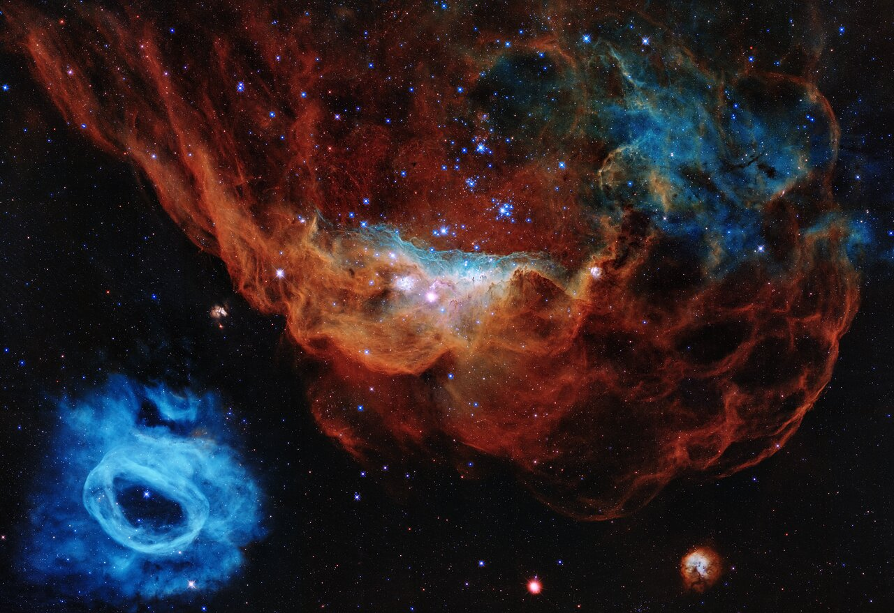

# Welcome to Nuc-Astro 2026

This is the official course website for Nuclear Astrophysics. Here you will find lecture notes, assignments, and reading materials.

## Course Overview
- **Instructor:** Dehiwalge Don Dilruwan
- **Term:** Spring 2026
- **Objective:** To explore the synthesis of elements in the universe.

## Table of Contents
* [Chapter 1: Stellar Nucleosynthesis](chapter1.md)

---
*Last updated: April 2026*